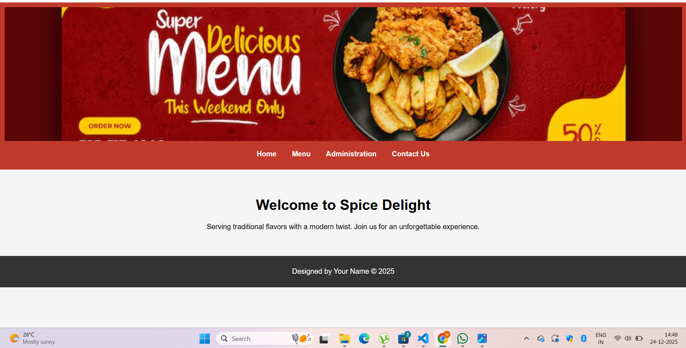

# Ex.07 Restaurant Website
# Date:
# AIM:
To develop a static Restaurant website to display the food items and services provided by them.

# DESIGN STEPS:
## Step 1:
Requirement collection.

## Step 2:
Creating the layout using HTML and CSS.

## Step 3:
Updating the sample content.

## Step 4:
Choose the appropriate style and color scheme.

## Step 5:
Validate the layout in various browsers.

## Step 6:
Validate the HTML code.

## Step 7:
Publish the website in the given URL.

# PROGRAM:
administration.html
'''


Administration — Spice Delight

<section class="team">
  <h2>Our Team</h2>
  

    
      

        
        
{{ member.name }} – {{ member.role }}

      

    
  

</section>

'''

base.html
'''


<!DOCTYPE html>
<html>
<head>
  <meta charset="utf-8">
  <title>Spice Delight</title>

</head>
<body>
  <header>
    
    <nav>
      <ul>
        <li><a href="">Home</a></li>
        <li><a href="">Menu</a></li>
        <li><a href="">Administration</a></li>
        <li><a href="">Contact Us</a></li>
      </ul>
    </nav>
  </header>

  <main>
    
  </main>

  <footer>
    
Designed by Your Name © 2025

  </footer>
</body>
</html>
'''

contact.html
'''


Contact Us — Spice Delight

<section class="contact">
  <h2>Contact Us</h2>
  
📍 Address: {{ contact.address }}

  
📞 Phone: {{ contact.phone }}

  
✉️ Email: {{ contact.email }}

</section>

'''

home.html
'''

Home — Spice Delight

<section class="intro">
  <h1>Welcome to Spice Delight</h1>
  
Serving traditional flavors with a modern twist. Join us for an unforgettable experience.

</section>

'''

menu.html
'''


Menu — Spice Delight

<section class="menu">
  <h2>Our Menu</h2>
  

    
      

        
        
{{ food.name }}

      

    
  

</section>

'''
# OUTPUT:

# RESULT:
The program for designing software company website using HTML and CSS is completed successfully.
